# Terraform Solution Architecture Diagram

This is a multi-tier AWS infrastructure supporting containerized applications with high availability.

## Architecture Overview

```mermaid
graph TB
    subgraph "Internet"
        users["👥 Users"]
    end

    subgraph "AWS VPC: 10.0.0.0/16"
        subgraph "Public Layer (eu-west-2a, eu-west-2b)"
            igw["🌐 Internet Gateway"]
            alb["🔴 Application Load Balancer<br/>Port 80<br/>Health Check: /"]
            eip_a["📍 Elastic IP (AZa)"]
            eip_b["📍 Elastic IP (AZb)"]
            
            subgraph "Public Subnets"
                pub_a["🟦 Public Subnet (AZa)<br/>10.0.1.0/24"]
                pub_b["🟦 Public Subnet (AZb)<br/>10.0.2.0/24"]
            end
            
            subgraph "NAT Gateways"
                nat_a["🔄 NAT Gateway (AZa)"]
                nat_b["🔄 NAT Gateway (AZb)"]
            end
        end

        subgraph "Web Layer (Private, eu-west-2a, eu-west-2b)"
            subgraph "Web Subnets"
                web_a["🟩 Web Subnet (AZa)<br/>10.0.10.0/24"]
                web_b["🟩 Web Subnet (AZb)<br/>10.0.11.0/24"]
            end
            
            subgraph "ECS Fargate"
                ecs_clust["🐳 ECS Cluster"]
                task_a["📦 Task 1 (AZa)<br/>nginx:1.25.3<br/>CPU:256 Mem:512"]
                task_b["📦 Task 2 (AZb)<br/>nginx:1.25.3<br/>CPU:256 Mem:512"]
            end
            
            ecs_sg["🔐 ECS Security Group<br/>Allow: ALB→:80"]
            cloudwatch["📊 CloudWatch<br/>Logs & Metrics<br/>Retention: 7 days"]
        end

        subgraph "Database Layer (Private, eu-west-2a, eu-west-2b)"
            subgraph "Database Subnets"
                db_a["🟪 DB Subnet (AZa)<br/>10.0.20.0/24"]
                db_b["🟪 DB Subnet (AZb)<br/>10.0.21.0/24"]
            end
            
            rds["🗄️ RDS PostgreSQL<br/>db.t3.micro<br/>20GB gp3<br/>Encrypted with KMS<br/>Backup: 1 day"]
            db_sg["🔐 DB Security Group<br/>Allow: ECS→:5432"]
            kms["🔒 KMS Key<br/>Auto-rotation<br/>DB Encryption"]
            secrets["🔑 Secrets Manager<br/>DB Credentials"]
        end

        subgraph "Routing"
            rt_pub["📋 Route Table (Public)<br/>0.0.0.0/0 → IGW"]
            rt_web_a["📋 Route Table (Web AZa)<br/>0.0.0.0/0 → NAT(AZa)"]
            rt_web_b["📋 Route Table (Web AZb)<br/>0.0.0.0/0 → NAT(AZb)"]
            rt_db["📋 Route Table (Database)<br/>Local routes only"]
        end
    end

    subgraph "AWS Services"
        alb_sg["🔐 ALB Security Group<br/>Allow: 0.0.0.0/0→:80"]
        iam_exec["👤 IAM Execution Role<br/>• CloudWatch Logs<br/>• ECR Pull<br/>• KMS Decrypt"]
        iam_task["👤 IAM Task Role<br/>• S3 Access<br/>• Custom permissions"]
        ecr["🏗️ ECR Image<br/>nginx:1.25.3-alpine"]
    end

    subgraph "Application Monitoring"
        container_insights["📈 Container Insights<br/>Optional"]
        alb_logs["📝 ALB Access Logs<br/>Optional"]
    end

    %% External connections
    users -->|HTTP| alb
    alb -->|Health Check| task_a
    alb -->|Health Check| task_b

    %% Internet Gateway
    igw --> pub_a
    igw --> pub_b
    alb --> igw

    %% Public Layer
    pub_a --> nat_a
    pub_b --> nat_b
    nat_a --> eip_a
    nat_b --> eip_b

    %% ALB to ECS
    alb --> ecs_sg
    alb -->|Target Group<br/>Port 80| task_a
    alb -->|Target Group<br/>Port 80| task_b

    %% ECS Cluster
    web_a --> task_a
    web_b --> task_b
    task_a --> iam_exec
    task_b --> iam_exec
    iam_exec --> ecr
    task_a --> iam_task
    task_b --> iam_task

    %% ECS Networking
    ecs_sg --> web_a
    ecs_sg --> web_b
    task_a --> cloudwatch
    task_b --> cloudwatch
    cloudwatch --> alb_logs
    task_a --> container_insights
    task_b --> container_insights

    %% NAT Routing
    task_a -->|Outbound| nat_a
    task_b -->|Outbound| nat_b
    rt_web_a --> nat_a
    rt_web_b --> nat_b
    web_a --> rt_web_a
    web_b --> rt_web_b

    %% Database connections
    task_a -->|Query| rds
    task_b -->|Query| rds
    db_a --> rds
    db_b --> rds
    rds --> kms
    rds --> secrets
    db_sg --> db_a
    db_sg --> db_b

    %% Routing tables
    pub_a --> rt_pub
    pub_b --> rt_pub
    db_a --> rt_db
    db_b --> rt_db

    %% Security
    alb --> alb_sg
    task_a --> ecs_sg
    task_b --> ecs_sg

    style users fill:#fff,stroke:#06c,stroke-width:2px
    style alb fill:#ff9,stroke:#f60,stroke-width:3px
    style task_a fill:#9cf,stroke:#06c,stroke-width:2px
    style task_b fill:#9cf,stroke:#06c,stroke-width:2px
    style rds fill:#cdc,stroke:#060,stroke-width:2px
    style ecs_sg fill:#fcc,stroke:#c00,stroke-width:2px
    style db_sg fill:#fcc,stroke:#c00,stroke-width:2px
    style alb_sg fill:#fcc,stroke:#c00,stroke-width:2px
    style kms fill:#f9f,stroke:#c0c,stroke-width:2px
    style secrets fill:#f9f,stroke:#c0c,stroke-width:2px
```



## Architecture Components

### 🌐 **Public Layer**
- **Internet Gateway**: Routes traffic from internet to public subnets
- **Application Load Balancer**: Distributes incoming HTTP traffic across ECS tasks
- **NAT Gateways**: Enable outbound internet access for private subnets (one per AZ for HA)
- **Elastic IPs**: Static IPs for NAT gateways

### 🟩 **Web Layer (Private)**
- **ECS Fargate Cluster**: Serverless container orchestration
- **ECS Tasks**: Running nginx containers (1 per AZ for HA)
- **CloudWatch Logs**: Container logs with 7-day retention
- **Security Group**: Allows inbound only from ALB on port 80

### 🟪 **Database Layer (Private)**
- **RDS PostgreSQL**: Encrypted database (db.t3.micro, 20GB)
- **KMS Encryption**: At-rest encryption with auto-rotation
- **Secrets Manager**: Secure credential storage
- **Security Group**: Allows inbound only from ECS on port 5432

### 📋 **Routing**
- **Public Route Table**: IGW routes (0.0.0.0/0 → IGW)
- **Web Route Tables**: Per-AZ NAT routes (0.0.0.0/0 → NAT per AZ)
- **Database Route Table**: Local routes only (no internet access)

## Key Features

✅ **High Availability**
- Multi-AZ deployment (eu-west-2a, eu-west-2b)
- NAT gateway per AZ for independent outbound routing
- Multiple ECS tasks across AZs
- ALB health checks for automatic task replacement

✅ **Security**
- 3-tier network isolation (public → web → database)
- Least-privilege security groups
- Encrypted database with KMS
- Private credentials in Secrets Manager
- IAM roles with minimal permissions

✅ **Scalability**
- Optional ECS auto-scaling (CPU/memory based)
- Optional RDS Multi-AZ
- Configurable task count and sizing

✅ **Observability**
- CloudWatch Logs for container output
- Optional Container Insights metrics
- ALB access logs (optional)
- Health checks at multiple layers

## Network CIDR Allocation

```
VPC: 10.0.0.0/16 (65,536 addresses)
├── Public Subnets: 10.0.1.0-10.0.2.0/24 (256 each)
├── Web Subnets: 10.0.10.0-10.0.11.0/24 (256 each)
└── Database Subnets: 10.0.20.0-10.0.21.0/24 (256 each)
```

## Data Flow

1. **User Request** → ALB (0.0.0.0/0:80)
2. **ALB** → ECS Task (private subnet, :80)
3. **ECS Task** → RDS (private subnet, :5432)
4. **ECS Task Logs** → CloudWatch Logs
5. **Outbound Traffic** → NAT Gateway → IGW → Internet
6. **Credentials** → Secrets Manager (KMS encrypted)

## Module Structure

```
terraform/solution/
├── modules/
│   ├── networking/     # VPC, subnets, NAT, IGW, route tables
│   ├── compute/        # ECS cluster, tasks, IAM, CloudWatch
│   ├── database/       # RDS, KMS, Secrets Manager
│   └── loadbalancer/   # ALB, target groups, security groups
└── environments/
    ├── dev/            # Dev configuration
    └── prod/           # Prod configuration
```

---

**This architecture is production-ready, secure, and highly available.**
